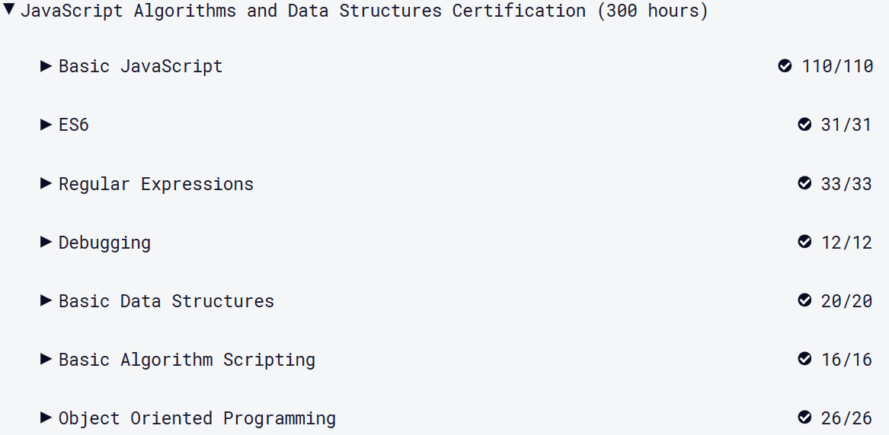

# CodeCamp#5

## ชญานิน ชลหาญ

ไปที่ https://www.freecodecamp.org/learn  
ทำโจทย์ของ "JavaScript Algorithms and Data Structures Certification (300 hours)" ในหัวข้อต่อไปนี้  
2.1. Basic JavaScript  
2.2. ES6  
2.3. Debugging  
2.4. Basic Data Structures  
2.5. Basic Algorithm Scripting  
2.6. Object Oriented Programming
